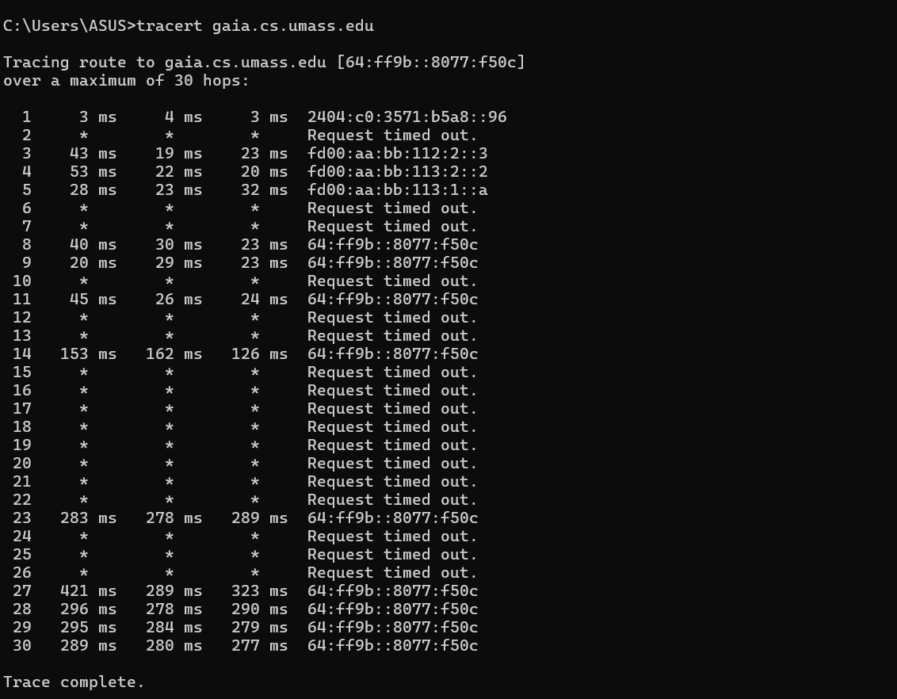
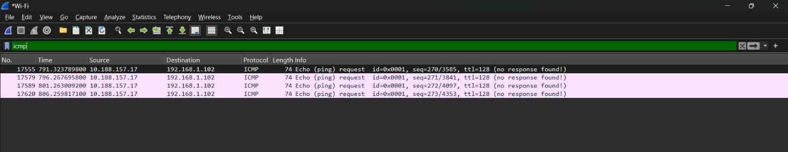
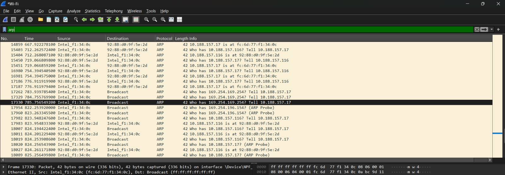
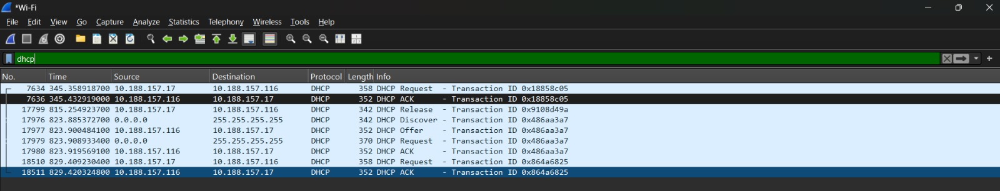

# Modul 10 - IP

## Tujuan Praktikum

* Menginvestigasi cara kerja protokol IP menggunakan Wireshark.
* Memahami IPv4, fragmentasi paket, dan IPv6.

---

## Dasar Teori

Internet Protocol (IP) merupakan protokol lapisan jaringan yang bertugas mengirimkan paket dari sumber ke tujuan. Pada praktikum ini diamati struktur paket IPv4, proses fragmentasi datagram, serta penggunaan IPv6 menggunakan Wireshark.

---

## Langkah Percobaan

1. Menjalankan Wireshark.
2. Melakukan traceroute ke `gaia.cs.umass.edu`.
3. Mengamati paket IPv4 yang terbentuk.
4. Menganalisis fragmentasi paket berukuran besar.
5. Mengamati paket IPv6 pada file trace yang disediakan.

---

## Hasil Percobaan

### IPv4

* Paket traceroute berhasil diamati.
* Router mengurangi nilai TTL pada setiap hop.

### Fragmentasi

* Datagram berukuran besar dipecah menjadi beberapa fragment IP.
* Setiap fragment memiliki Identification yang sama.

### IPv6

* Ditemukan paket DNS tipe AAAA yang digunakan untuk memperoleh alamat IPv6.

---

## Analisis

IPv4 menggunakan mekanisme TTL untuk mencegah paket berputar tanpa batas di jaringan. Saat ukuran datagram melebihi MTU, paket akan dipecah menjadi beberapa fragment. IPv6 hadir untuk mengatasi keterbatasan IPv4 dengan ruang alamat yang jauh lebih besar.

---

## Kesimpulan

1. IPv4 menggunakan TTL dan fragmentasi dalam pengiriman paket.
2. Fragmentasi terjadi ketika ukuran datagram melebihi MTU.
3. IPv6 menyediakan ruang alamat yang lebih besar dibanding IPv4.
4. Wireshark dapat digunakan untuk menganalisis paket IP secara detail.

---

## Dokumentasi

