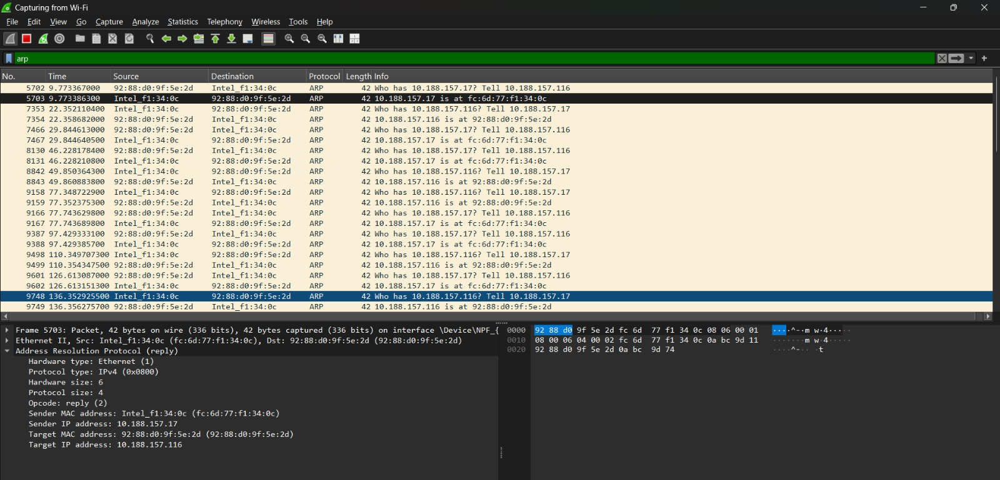
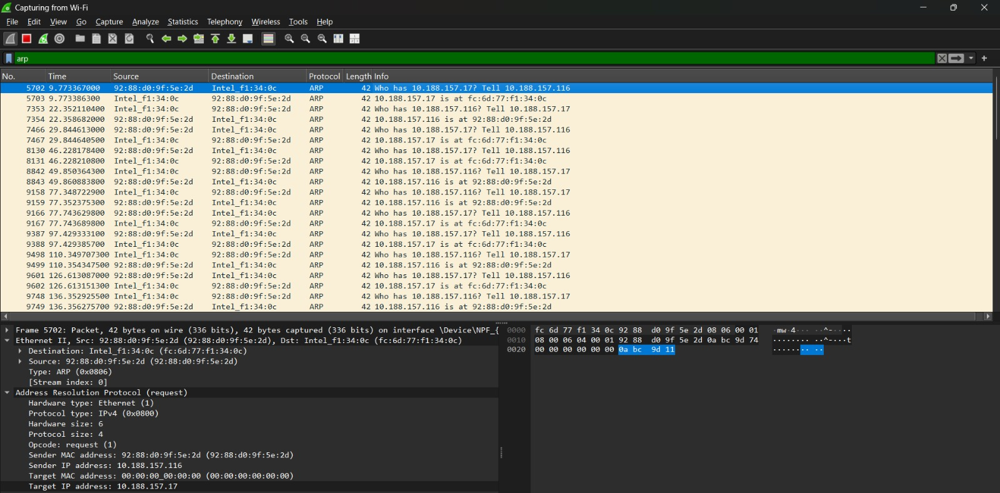

# Modul 11 - DHCP

---

## Tujuan Praktikum

* Menginvestigasi cara kerja protokol DHCP menggunakan Wireshark.

---

## Dasar Teori

Dynamic Host Configuration Protocol (DHCP) digunakan untuk memberikan alamat IP dan konfigurasi jaringan secara otomatis kepada host yang terhubung ke jaringan.

---

## Langkah Percobaan

1. Melepaskan alamat IP menggunakan `ipconfig /release`.
2. Menjalankan Wireshark.
3. Meminta alamat IP baru menggunakan `ipconfig /renew`.
4. Mengamati paket DHCP pada Wireshark.

---

## Hasil Percobaan

Urutan proses DHCP yang berhasil diamati:

1. DHCP Discover
2. DHCP Offer
3. DHCP Request
4. DHCP ACK

Paket-paket tersebut terlihat pada hasil tangkapan Wireshark.

---

## Analisis

DHCP bekerja menggunakan mekanisme DORA (Discover, Offer, Request, Acknowledgement). Proses ini memungkinkan perangkat memperoleh alamat IP secara otomatis tanpa konfigurasi manual.

---

## Kesimpulan

1. DHCP mempermudah konfigurasi jaringan.
2. Alamat IP dapat diberikan secara otomatis oleh DHCP Server.
3. Proses DORA merupakan mekanisme utama DHCP.
4. Wireshark dapat digunakan untuk memantau seluruh proses DHCP.

---

## Dokumentasi

