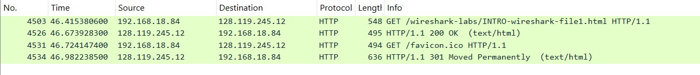
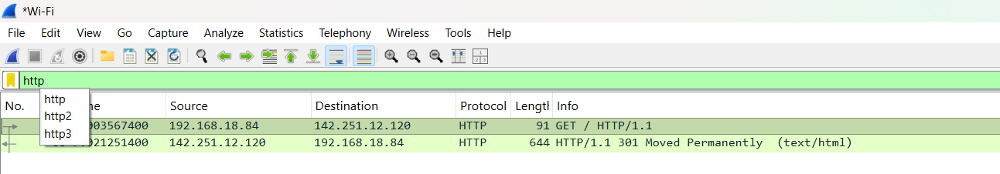
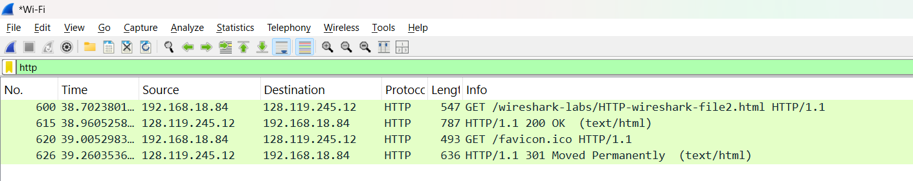
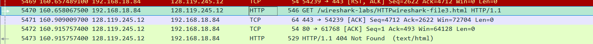
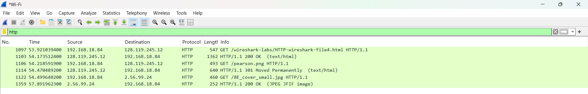
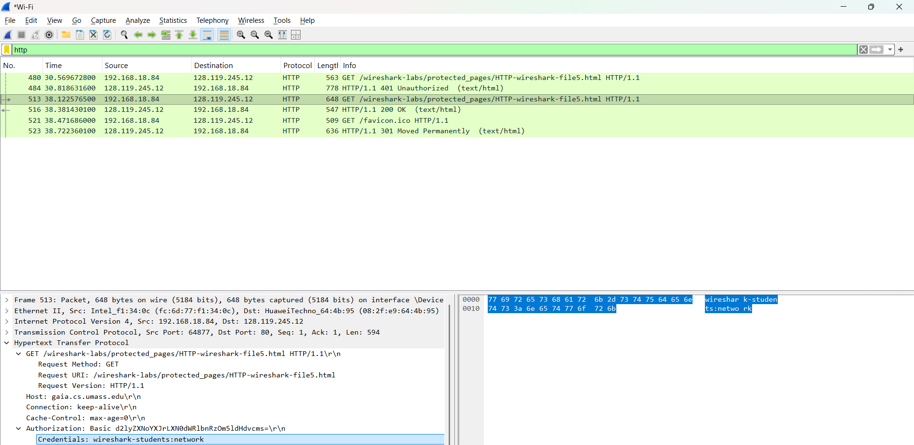

# LAPORAN MODUL 3
Analisis Hasil Praktikum Wireshark
## ss ke 1 dan 2
Pada paket no. 4503,(192.168.18.84) mengirimkan pesan HTTP GET ke server 128.119.245.12 untuk mengambil file INTRO-wireshark-file1.html.

Respon Server: Server memberikan respon pada paket no. 4526 dengan status 200 OK, yang berarti file berhasil ditemukan dan dikirimkan ke browser kamu.

Terlihat juga permintaan otomatis untuk favicon.ico (paket 4531) yang dibalas dengan status 301 Moved Permanently oleh server
## ss ke 3
HTTP-wireshark-file2.html (paket no. 600).
Server membalas dengan 200 OK (paket no. 615).
Jika melakukan refresh pada browser tanpa membersihkan cache, biasanya akan muncul header If-Modified-Since. Namun, di tangkapan layar ini, terlihat interaksi pengambilan awal yang sukses.
## ss ke 4 dan 4.1
Pada paket no. 6153, kamu meminta file HTTP-wireshark-file3.html.
Di tangkapan layar lain (paket no. 5470-5473), terlihat ada protokol TCP yang bekerja di sela-sela HTTP. Ini membuktikan bahwa untuk file yang panjang, data akan dipecah menjadi beberapa segmen TCP sebelum disusun kembali oleh browser.

Error 404: Terlihat pada paket no. 5473, sempat muncul status 404 Not Found. Ini biasanya terjadi jika ada kesalahan pengetikan URL atau file sempat tidak tersedia di server saat proses capture.
## ss ke 5
Saat meminta satu file HTML (paket no. 1097), browser secara otomatis melakukan request tambahan.

Objek Tersemat: * Paket no. 1106: Browser meminta gambar pearson.png.

Paket no. 1122: Browser meminta gambar 8E_cover_small.jpg ke server yang berbeda (2.56.99.24).

Kesimpulan: Satu halaman web seringkali terdiri dari banyak objek yang diambil dari server yang berbeda-beda.
## ss ke 6
Pada paket no. 480,mencoba mengakses halaman yang diproteksi. Server awalnya membalas dengan 401 Unauthorized (paket no. 484).

Pengiriman Kredensial: Setelah kamu memasukkan username dan password, browser mengirimkan kembali permintaan (paket no. 513) dengan header Authorization.

Data Terbuka: Pada bagian detail paket bawah (gambar terakhir), terlihat jelas bahwa Wireshark dapat men-decode kredensial tersebut: Credentials: wireshark-students:network.

Ini membuktikan bahwa HTTP Basic Authentication tidak aman karena username dan password dikirimkan dalam format yang mudah dibaca (Base64) tanpa enkripsi, sehingga mudah dicuri melalui teknik sniffing. 
## Kesimpulan Laporan:
Praktikum ini berhasil menunjukkan bahwa protokol HTTP bekerja di atas transport TCP. Kita dapat melihat bagaimana status kode (200, 301, 401, 404) merepresentasikan kondisi komunikasi antara client dan server. Selain itu, terbukti bahwa objek seperti gambar memerlukan koneksi terpisah, dan penggunaan HTTP biasa untuk autentikasi sangat berisiko bagi keamanan data.

# Lampiran File

