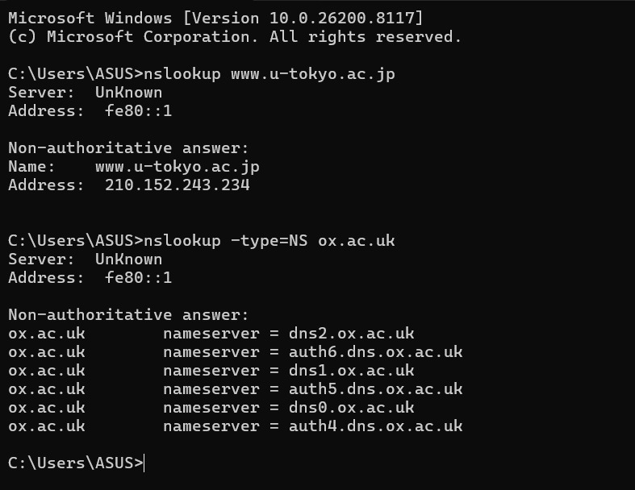
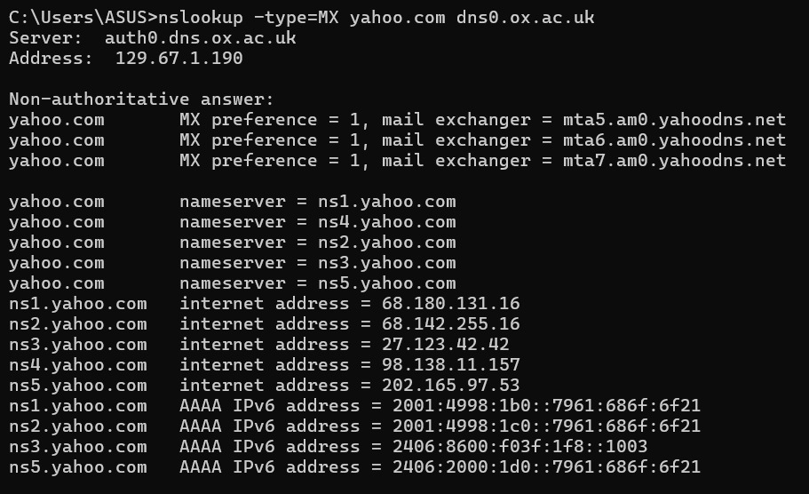
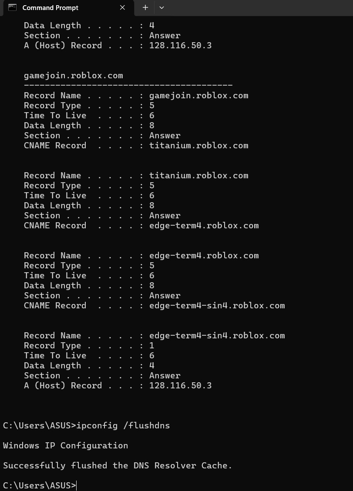
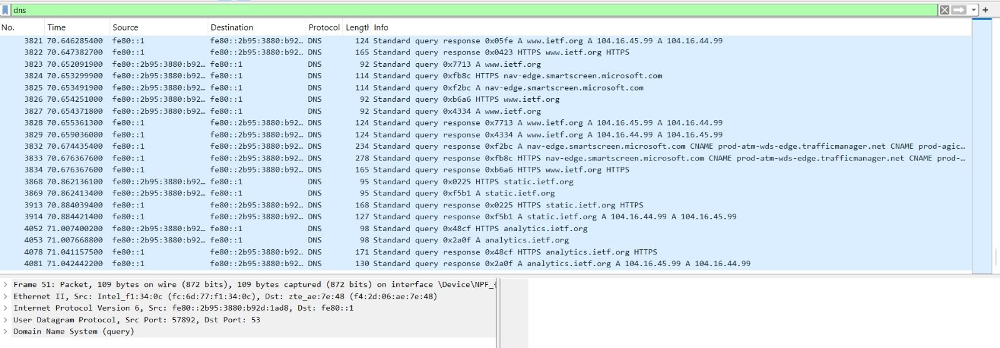
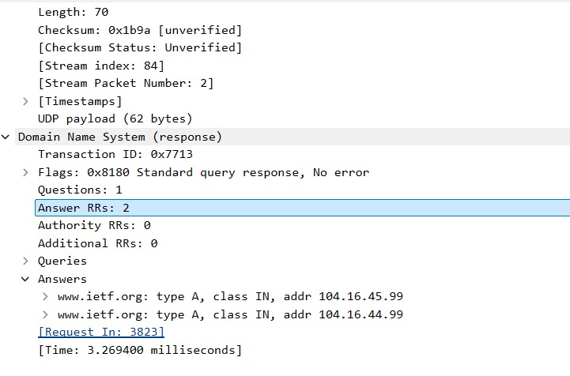

# Laporan Praktikum Jaringan Komputer - Modul 4: DNS

## 1. Tujuan Praktikum
1. Menginvestigasi cara kerja Domain Name System (DNS).
2. Memahami penggunaan perintah `nslookup` dan `ipconfig`.
3. Menganalisis paket DNS query dan response menggunakan Wireshark.

## 2. Eksperimen nslookup & ipconfig

### A. nslookup (Lookup Alamat IP & Name Server)
1. **Lookup Web Asia (`www.u-tokyo.ac.jp`):** - IP Address yang didapat: `210.152.243.234`
2. **Lookup Name Server Eropa (`ox.ac.uk`):**
   - Daftar NS: `dns0.ox.ac.uk`, `dns1.ox.ac.uk`, `dns2.ox.ac.uk`, dsb.
3. **Lookup Mail Server Yahoo via Server Oxford:**
   - Perintah: `nslookup -type=MX yahoo.com dns0.ox.ac.uk`
   - Hasil Mail Exchanger: `mta5.am0.yahoodns.net`, `mta6.am0.yahoodns.net`, `mta7.am0.yahoodns.net` dengan preference = 1.

### B. ipconfig (DNS Cache Management)
- **ipconfig /flushdns:** Berhasil dilakukan untuk membersihkan cache DNS agar proses tracing di Wireshark akurat.

> # lampiran file cmd

## 3. Analisis Tracing DNS dengan Wireshark

Berdasarkan hasil tangkapan paket saat mengakses `http://www.ietf.org`:

| No | Pertanyaan Analisis | Hasil Investigasi |
|----|----------------------|-------------------|
| 1  | Protokol Transport   | UDP (User Datagram Protocol) |
| 2  | Port Tujuan Query    | Port 53 |
| 3  | Alamat IP Tujuan     | [192.168.1.1] |
| 4  | Tipe Pesan DNS       | Type A  |
| 5  | Jumlah Jawaban (Answers) | [2] |
| 6  | Verifikasi TCP SYN   | Ya, sesuai. |

### Detail Analisis Paket:
1. **DNS Query:** Pesan dikirim dari laptop untuk menanyakan alamat IP dari `www.ietf.org`.
2. **DNS Response:** Server memberikan jawaban berupa alamat IP. Pada bagian "Answers", terlihat nilai TTL (Time to Live) yang menunjukkan durasi record disimpan di cache.

# lampiran file wireshark

## 4. Kesimpulan
Dari praktikum ini, dapat disimpulkan bahwa DNS berfungsi sebagai "buku telepon" internet yang menerjemahkan nama host yang mudah diingat manusia menjadi alamat IP yang dipahami mesin. Penggunaan protokol UDP pada port 53 memastikan proses resolusi nama berlangsung cepat sebelum koneksi TCP (seperti HTTP) dilakukan.