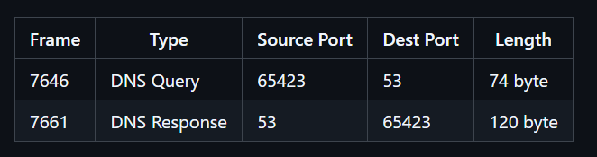
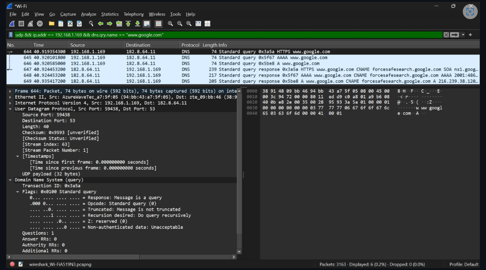
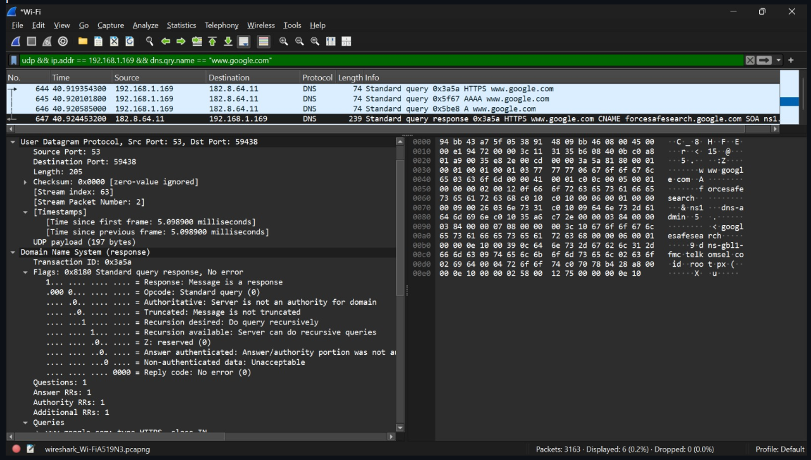

# Laporan Praktikum Jaringan Komputer - Modul 5

## User Datagram Protocol (UDP)

### 5.1 Tujuan Praktikum
1. Investigasi cara kerja UDP menggunakan Wireshark.
2. Identifikasi struktur header UDP dan field-fieldnya.
3. Analisis hubungan port source-destination pada komunikasi UDP.
4. Hitung kapasitas maksimum payload UDP.
### 5.2 Langkah Kerja & Hasil
#### 5.2.1 Capture Paket UDP
Langkah:

1. Buka Wireshark → pilih interface Wi-Fi → Start Capture
2. Jalankan perintah untuk memicu traffic UDP:
[ipconfig /flushdns]
[nslookup google.com]
3. Stop capture → terapkan filter:
4. udp && ip.addr == 10.159.118.110 && dns.qry.name == "www.google.com"
## hasil screenshoots

#### 5.2.2 Analisis Header UDP
Struktur Header (8 byte total):

[| Source Port (2B) | Dest Port (2B) | Length (2B) | Checksum (2B) |
Hasil Analisis dari Wireshark:]

Field	Query (Frame 7646)	Response (Frame 7661)
Source Port	- 65423	 - 53
Destination Port - 	53	- 65423
Length	- 74 byte	- 120 byte
Checksum	- 0x02bf	- 0xfb78

Perhitungan Payload:

Query: 74 - 8 = 66 byte payload
Response: 120 - 8 = 112 byte payload
#### 5.2.3 Perhitungan Teknis UDP
Parameter	- Perhitungan	- Hasil
Maksimum Length (16-bit)	- 2¹⁶ - 1	- 65.535 byte
Maksimum Payload	- 65.535 - 8	- 65.527 byte
Rentang Port	- 0 - 2¹⁶ - 1	- 0 - 65.535
Protocol Number (IP Header) 	-	  - 17 (0x11)
Catatan: Untuk menghindari fragmentasi IP pada Ethernet (MTU 1500), payload UDP disarankan ≤ 1472 byte (1500 - 20 IP header - 8 UDP header).

#### 5.2.4 Pola Komunikasi Request-Response
Mapping Port & IP:

[REQUEST:  10.159.118.110:65423 → 10.159.118.217:53
RESPONSE: 10.159.118.217:53    → 10.159.118.110:65423]

Poin Kunci:

* Port source response = port destination request (dan sebaliknya)
* Client pakai ephemeral port 65423 (range 49152-65535)
* Server DNS pakai well-known port 53
* Transaction ID 0xc7e3 sama pada query & response → untuk matching

Hasil Query DNS:

* Query Type: HTTPS (65) - RFC 8484 (bukan type A standar)
* Response: www.google.com → CNAME → forcesafesearch.google.com
* Indikasi: Google SafeSearch aktif pada koneksi ini

### 5.3 Ringkasan Hasil
Parameter	             - Nilai
Jumlah field header UDP	- 4 (Source Port, Dest Port, Length, Checksum)
Ukuran total header	- 8 byte (fixed)
Payload query	- 66 byte
Payload response	- 112 byte
Maksimum payload teoritis	- 65.527 byte
Maksimum payload praktis (Ethernet)	- ~1472 byte
Rentang port	- 0 - 65.535
Protocol number UDP	- 17 (0x11)
Pola port request-response	- Dibalik (source ↔ destination)

### 5.4 Kesimpulan Praktis
1. Header UDP hanya 8 byte (4 field × 2 byte) → overhead kecil, cocok untuk aplikasi real-time.
2. Field Length mencakup header + payload; nilai pada capture: 74 byte (query) dan 120 byte (response).
3. Payload maksimum teoritis 65.527 byte, tapi untuk Ethernet sebaiknya ≤ 1472 byte agar tidak fragmentasi.
4. Port UDP range 0-65.535; praktikum menggunakan port 53 (DNS server) dan 65423 (ephemeral client).
5. UDP menggunakan protocol number 17 pada IP header.
6. Pola komunikasi UDP: port source-destination dibalik pada response, dengan Transaction ID sama untuk matching.
7. Wireshark efektif untuk analisis langsung: lihat header, hitung payload, dan lacak alur request-response.