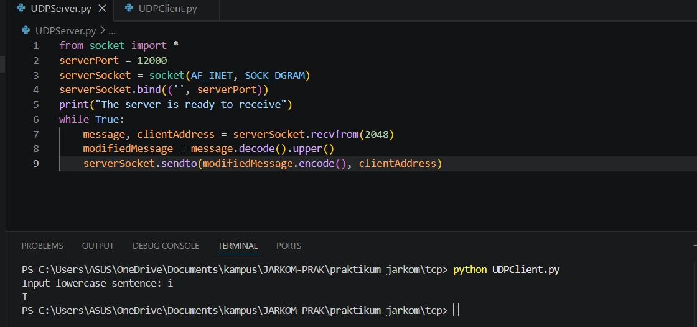
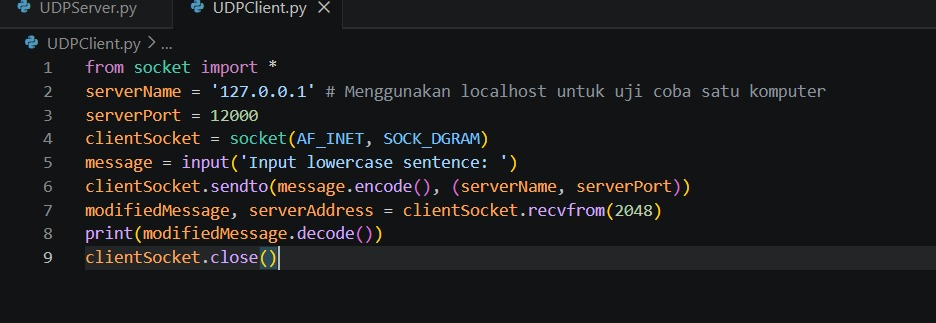
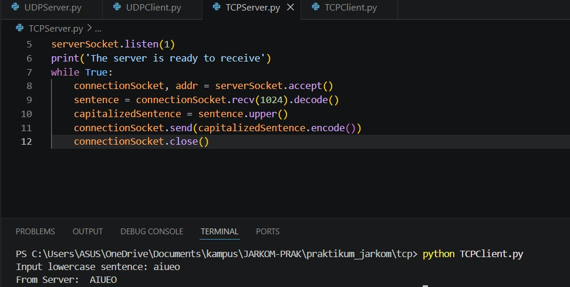
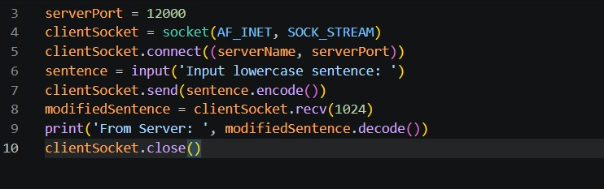

# Modul 7: Socket Programming – Membuat Aplikasi Jaringan

## Identitas Praktikum

| Keterangan | Isi |
|------------|-----|
| Mata Kuliah | Jaringan Komputer |
| Modul | Modul 7 – Socket Programming |
| Bahasa Pemrograman | Python 3 |
| Topik | Implementasi Socket UDP dan TCP |
| Repository | GitHub |

---

# 1. Tujuan Praktikum

1. Memahami konsep komunikasi jaringan menggunakan Socket Programming.
2. Mengimplementasikan aplikasi Client-Server berbasis UDP.
3. Mengimplementasikan aplikasi Client-Server berbasis TCP.
4. Menganalisis perbedaan karakteristik komunikasi UDP dan TCP.
5. Memahami proses pengiriman dan penerimaan data pada jaringan komputer.

---

# 2. Dasar Teori

Socket merupakan antarmuka yang digunakan oleh aplikasi untuk berkomunikasi melalui jaringan komputer. Komunikasi socket umumnya melibatkan dua program yaitu:

- **Client** : Program yang mengirimkan permintaan.
- **Server** : Program yang menerima permintaan dan memberikan respons.

Dalam pemrograman jaringan terdapat dua protokol transport yang paling sering digunakan:

## 2.1 UDP (User Datagram Protocol)

UDP merupakan protokol yang bersifat **connectionless**, artinya tidak memerlukan proses pembentukan koneksi sebelum mengirim data.

### Karakteristik UDP

- Tidak memerlukan handshake.
- Pengiriman data lebih cepat.
- Tidak menjamin data sampai.
- Tidak menjamin urutan paket.
- Overhead kecil.

## 2.2 TCP (Transmission Control Protocol)

TCP merupakan protokol yang bersifat **connection-oriented**, artinya harus membangun koneksi terlebih dahulu sebelum data ditransmisikan.

### Karakteristik TCP

- Menggunakan proses Three-Way Handshake.
- Menjamin pengiriman data.
- Menjamin urutan data.
- Memiliki mekanisme kontrol kesalahan.
- Lebih andal dibanding UDP.

---

# 3. Implementasi Program

## A. Program Socket UDP

### UDP Server (`UDPServer.py`)

```python
from socket import *

serverPort = 12000
serverSocket = socket(AF_INET, SOCK_DGRAM)

serverSocket.bind(('', serverPort))

print("The server is ready to receive")

while True:
    message, clientAddress = serverSocket.recvfrom(2048)
    modifiedMessage = message.decode().upper()
    serverSocket.sendto(modifiedMessage.encode(), clientAddress)
```

### UDP Client (`UDPClient.py`)

```python
from socket import *

serverName = '127.0.0.1'
serverPort = 12000

clientSocket = socket(AF_INET, SOCK_DGRAM)

message = input('Input lowercase sentence: ')

clientSocket.sendto(message.encode(), (serverName, serverPort))

modifiedMessage, serverAddress = clientSocket.recvfrom(2048)

print(modifiedMessage.decode())

clientSocket.close()
```

---

## B. Program Socket TCP

### TCP Server (`TCPServer.py`)

```python
from socket import *

serverPort = 12000

serverSocket = socket(AF_INET, SOCK_STREAM)

serverSocket.bind(('', serverPort))

serverSocket.listen(1)

print('The server is ready to receive')

while True:
    connectionSocket, addr = serverSocket.accept()

    sentence = connectionSocket.recv(1024).decode()

    capitalizedSentence = sentence.upper()

    connectionSocket.send(capitalizedSentence.encode())

    connectionSocket.close()
```

### TCP Client (`TCPClient.py`)

```python
from socket import *

serverName = '127.0.0.1'
serverPort = 12000

clientSocket = socket(AF_INET, SOCK_STREAM)

clientSocket.connect((serverName, serverPort))

sentence = input('Input lowercase sentence: ')

clientSocket.send(sentence.encode())

modifiedSentence = clientSocket.recv(1024)

print('From Server:', modifiedSentence.decode())

clientSocket.close()
```

---

# 4. Analisis Program

## 4.1 Analisis UDP Client

### Membuat Socket

```python
clientSocket = socket(AF_INET, SOCK_DGRAM)
```

Keterangan:

- `AF_INET` digunakan untuk alamat IPv4.
- `SOCK_DGRAM` menunjukkan socket UDP.

### Mengirim Data

```python
clientSocket.sendto(message.encode(), (serverName, serverPort))
```

Fungsi:

- Mengubah string menjadi byte menggunakan `encode()`.
- Mengirim data ke alamat tujuan.

### Menerima Balasan

```python
modifiedMessage, serverAddress = clientSocket.recvfrom(2048)
```

Fungsi:

- Menerima data dari server.
- Menyimpan alamat pengirim.

---

## 4.2 Analisis UDP Server

### Binding Port

```python
serverSocket.bind(('', serverPort))
```

Fungsi:

- Mengaitkan socket dengan port 12000.
- Menunggu paket yang masuk.

### Menerima Paket

```python
message, clientAddress = serverSocket.recvfrom(2048)
```

Fungsi:

- Membaca paket dari client.
- Menyimpan alamat client.

### Mengubah Huruf Menjadi Kapital

```python
modifiedMessage = message.decode().upper()
```

Fungsi:

- Mengubah byte menjadi string.
- Mengubah seluruh huruf menjadi kapital.

### Mengirim Balasan

```python
serverSocket.sendto(modifiedMessage.encode(), clientAddress)
```

Fungsi:

- Mengirim hasil konversi kembali ke client.

---

## 4.3 Analisis TCP Client

### Membuat Socket TCP

```python
clientSocket = socket(AF_INET, SOCK_STREAM)
```

Keterangan:

- `SOCK_STREAM` digunakan untuk TCP.

### Membentuk Koneksi

```python
clientSocket.connect((serverName, serverPort))
```

Fungsi:

- Melakukan proses koneksi ke server.
- Menjalankan mekanisme handshake TCP.

### Mengirim Data

```python
clientSocket.send(sentence.encode())
```

Fungsi:

- Mengirim data melalui koneksi yang sudah terbentuk.

### Menerima Data

```python
modifiedSentence = clientSocket.recv(1024)
```

Fungsi:

- Menerima data dari server.

---

## 4.4 Analisis TCP Server

### Membuat Listening Socket

```python
serverSocket.listen(1)
```

Fungsi:

- Menunggu permintaan koneksi dari client.

### Menerima Koneksi

```python
connectionSocket, addr = serverSocket.accept()
```

Fungsi:

- Membuat socket baru khusus untuk client yang terhubung.
- Socket utama tetap mendengarkan koneksi lain.

### Membaca Data

```python
sentence = connectionSocket.recv(1024).decode()
```

Fungsi:

- Menerima pesan dari client.

### Mengirim Balasan

```python
connectionSocket.send(capitalizedSentence.encode())
```

Fungsi:

- Mengirim hasil konversi huruf kapital.

### Menutup Koneksi

```python
connectionSocket.close()
```

Fungsi:

- Mengakhiri koneksi setelah komunikasi selesai.

---

# 5. Hasil Pengujian

## Pengujian UDP

Input:

```text
i
```

Output:

```text
I
```

Keterangan:

Server berhasil menerima karakter dari client dan mengubahnya menjadi huruf kapital sebelum mengirimkan kembali.

---

## Pengujian TCP

Input:

```text
aiueo
```

Output:

```text
AIUEO
```

Keterangan:

Server TCP berhasil menerima data, memprosesnya menjadi huruf kapital, lalu mengirimkan hasilnya kembali kepada client melalui koneksi TCP.

---

# 6. Perbandingan UDP dan TCP

| Karakteristik | UDP | TCP |
|--------------|-----|-----|
| Jenis Koneksi | Connectionless | Connection-Oriented |
| Handshake | Tidak Ada | Three-Way Handshake |
| Kecepatan | Lebih Cepat | Lebih Lambat |
| Keandalan | Tidak Dijamin | Dijamin |
| Urutan Data | Tidak Dijamin | Dijamin |
| Fungsi Kirim | `sendto()` | `send()` |
| Fungsi Terima | `recvfrom()` | `recv()` |
| Mekanisme Server | Satu Socket | Welcoming Socket + Connection Socket |
| Cocok Untuk | Streaming, VoIP, Game Online | Web, FTP, Email |

---

# 7. Kesimpulan

Berdasarkan hasil praktikum yang telah dilakukan, dapat disimpulkan bahwa:

1. Socket Programming memungkinkan komunikasi antara client dan server melalui jaringan komputer.
2. UDP menggunakan mekanisme connectionless sehingga proses komunikasi lebih cepat karena tidak memerlukan handshake.
3. TCP menggunakan mekanisme connection-oriented yang menjamin keandalan pengiriman data melalui proses handshake.
4. Pada pengujian, baik UDP maupun TCP berhasil mengubah input huruf kecil menjadi huruf kapital dan mengirimkan hasilnya kembali ke client.
5. Pemilihan UDP atau TCP bergantung pada kebutuhan aplikasi, apakah lebih mengutamakan kecepatan atau keandalan komunikasi.

---

# Referensi

1. Kurose, J. F., & Ross, K. W. *Computer Networking: A Top-Down Approach*.
2. Python Documentation – Socket Programming.
3. Modul Praktikum Jaringan Komputer – Socket Programming.





