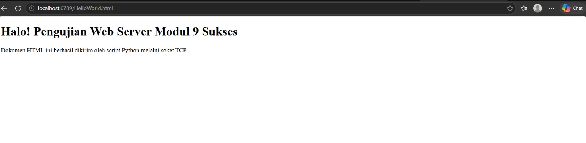

# Modul 9 - Web Server

---

## Tujuan Praktikum

* Memahami konsep dasar Web Server.
* Memahami komunikasi client-server menggunakan socket TCP.
* Membuat Web Server sederhana menggunakan Python.
* Menangani request dan response HTTP.

---

## Dasar Teori

Web Server merupakan aplikasi yang bertugas menerima request dari client menggunakan protokol HTTP dan mengirimkan response berupa halaman web atau data lainnya. Pada praktikum ini Web Server dibuat menggunakan Socket Programming Python dengan protokol TCP.

Server akan menunggu koneksi dari client, membaca request HTTP yang diterima, kemudian mengirimkan file HTML yang diminta. Jika file tidak ditemukan maka server akan mengirimkan pesan error **404 Not Found**.

---

## Source Code

```python
from socket import *
import sys

serverSocket = socket(AF_INET, SOCK_STREAM)

serverPort = 6789
serverSocket.bind(('', serverPort))
serverSocket.listen(1)

while True:
    print('Ready to serve...')
    connectionSocket, addr = serverSocket.accept()

    try:
        message = connectionSocket.recv(1024).decode()
        filename = message.split()[1]

        f = open(filename[1:])
        outputdata = f.read()

        connectionSocket.send("HTTP/1.1 200 OK\r\n\r\n".encode())

        for i in range(len(outputdata)):
            connectionSocket.send(outputdata[i].encode())

        connectionSocket.send("\r\n".encode())
        connectionSocket.close()

    except IOError:
        connectionSocket.send("HTTP/1.1 404 Not Found\r\n\r\n".encode())
        connectionSocket.send(
            "<html><body><h1>404 Not Found</h1></body></html>".encode()
        )
        connectionSocket.close()

serverSocket.close()
sys.exit()
```

---

## Langkah Percobaan

1. Membuat file `HelloWorld.html`.
2. Menjalankan program Web Server Python.
3. Menentukan alamat IP perangkat.
4. Membuka browser.
5. Mengakses alamat:

```text
http://localhost:6789/HelloWorld.html
```

6. Mengamati response yang diberikan server.
7. Menguji akses file yang tidak tersedia untuk melihat response error.

---

## Hasil Percobaan

### Menjalankan Server

Server berhasil berjalan dan menunggu koneksi client.

```bash
Ready to serve...
```

### Akses Halaman HTML

Client berhasil mengakses file HTML melalui browser menggunakan alamat:

```text
http://localhost:6789/HelloWorld.html
```

Halaman HTML berhasil ditampilkan.

> Tambahkan screenshot hasil browser di sini.

### Pengujian Error 404

Saat client meminta file yang tidak tersedia, server mengirimkan response:

```http
HTTP/1.1 404 Not Found
```

> Tambahkan screenshot error 404 di sini.

---

## Analisis

Pada percobaan ini Web Server berhasil dibuat menggunakan socket TCP Python. Server mampu menerima request dari browser, membaca nama file yang diminta, dan mengirimkan isi file sebagai response HTTP.

Ketika file ditemukan, server mengirimkan status `200 OK`. Sebaliknya, jika file tidak ditemukan, server mengirimkan status `404 Not Found`.

Praktikum ini menunjukkan bagaimana mekanisme dasar komunikasi HTTP bekerja pada arsitektur client-server.

---

## Kesimpulan

1. Web Server sederhana dapat dibuat menggunakan Python Socket Programming.
2. Browser berkomunikasi dengan server menggunakan protokol HTTP di atas TCP.
3. Server dapat mengirimkan file HTML kepada client yang meminta.
4. Error `404 Not Found` digunakan ketika file yang diminta tidak tersedia.
5. Praktikum ini membantu memahami proses request dan response pada Web Server.

---

## Dokumentasi
